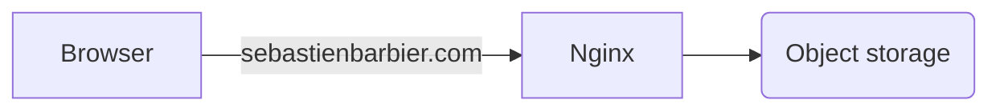

# Architecture

## Nginx

Main domain name redirect to a nginx instance configured using the [config-proxy](https://github.com/sebastienbarbier/config-proxy) repository.

Current instance run on an OVH VPS instance, and also generate server-side statistics.

## Object storage

Using S3-like infrastructure, static files are stored within an OVH object storage. 

Files are generated and deployed on every commit within the main branch.
